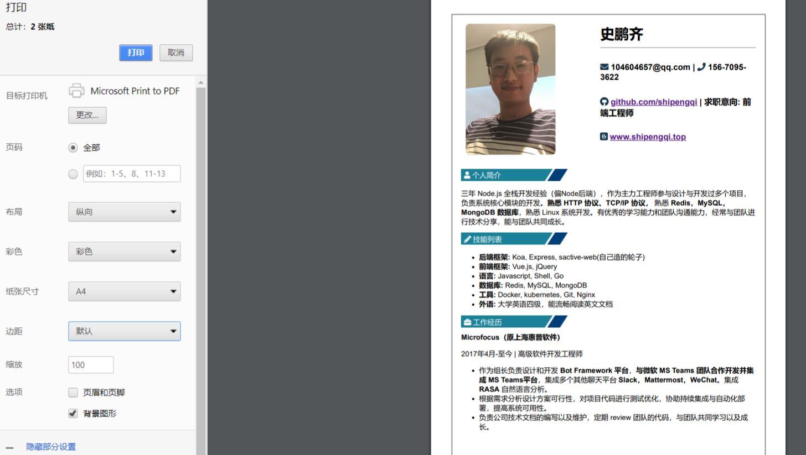

# resume
My resume template.

简历原始模版在[这里](https://github.com/resumejob/awesome-resume)。如何写好简历也参考[这里](https://github.com/resumejob/awesome-resume)。

## Getting Started

1. 修改`src`目录下的`free_resume.html`文件，将简历内容替换成你自己的。
2. 在浏览器打开`free_resume.html`文件，预览简历效果，比例调整到`150%`。
3. 右键打印。如下图：

